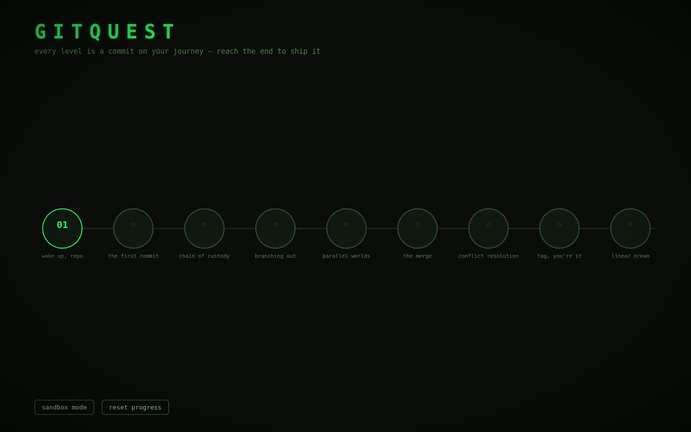

# GitQuest ⑂

**Learn Git by playing it.** A terminal-styled browser game where you type *real*
git commands and watch an animated commit graph come alive. Built for the
Beginner's Paradise — FirstCommit hackathon: a game about your first commit,
built as our first commit.

**▶ Play it live:** <https://georgefifth.github.io/gitquest/> ·
**📼 Demo video:** [`demo.mp4`](./demo.mp4) (3 min, narrated) ·
reviewers: append `?unlock` to open every level at once.



## How to play

Each level hands you a broken (or empty) repository and a **target graph**.
Type git commands into the terminal — `git add`, `git commit`, `git switch`,
`git merge`, `git rebase`… — and beat the level when your repo's *structure*
matches the target. It checks the shape of history, not the commands you used,
so there's more than one right answer.

- **11 levels**: `init` → first commit → branching → merging → **resolving a real
  merge conflict** → tagging → rebasing → `reset --hard` time travel → `git push`.
- **Star ratings** (Git-Golf style): finish a level in ≤ par commands for ★★★.
  Peeking at `solution` caps you at ★ — understanding > copying.
- **Sandbox mode**: a free repo with every command unlocked.
- Live commit graph with branch labels, HEAD marker, remote branches and tags.
- Tab-completion, command history, hints, and a forgiving engine that explains
  *why* git refused.
- Safety nets: `undo` (pops your last commit — even the root), `reset`, and an
  automatic warning when your history can't reach the target anymore.
- Meta commands: `hint` `objective` `solution` `undo` `reset` `map` — plus git
  extras like `git tag -d`, `git push --delete`, `git remote remove`.

## Run it

No build step, no dependencies:

```bash
python3 -m http.server 8000
# open http://localhost:8000
```

or any static server (`npx serve`, GitHub Pages, etc.).

## Tech

Vanilla HTML/CSS/JavaScript with ES modules. The commit graph is hand-drawn
**SVG** (custom lane-assignment layout, like `git log --graph`). Sound effects
are synthesized with **WebAudio** — zero audio assets. Progress persists in
`localStorage`.

The git simulation (`js/engine/git.js`) is a real state machine: commits,
branches, HEAD (incl. detached), staging area, merge bases, fast-forward vs.
true merges, conflict markers, rebases, tags and a fake remote — all pure JS,
unit-tested in node (`npm test`, 50+ assertions incl. proof that every level
is solvable). An end-to-end playtest drives headless Firefox through all 11
levels plus every button (`npm run playtest`, needs `npm i -D playwright`).

## Project layout

```
index.html            screens: boot / level-select / play
css/style.css         phosphor-terminal theme, scanlines and all
js/engine/git.js      the mini-git simulator (DOM-free)
js/engine/check.js    structural graph equality (DAG isomorphism)
js/engine/levels.js   level definitions (setup + solution scripts)
js/ui/graph.js        SVG commit-graph renderer
js/ui/terminal.js     terminal I/O, history, tab completion
js/audio.js           WebAudio bleeps
js/main.js            game state, screens, save file
test/engine.test.mjs  node test harness
```

## AI usage disclosure

This project was built with **Devin** (an AI pair-programmer by Cognition) as a
collaborator: it wrote the bulk of the implementation, while the concept,
level design direction, play-testing and review were human-driven. AI tooling
was used as a learning aid, per the hackathon's AI policy — every mechanic in
the game is explained in the demo video.

## Credits

- Everything in this repo (code, art direction, level text, sounds) was
  generated during the hackathon — no external assets used.
- Font stack: system monospace (`JetBrains Mono` / `Fira Code` fallbacks).

## License

MIT
